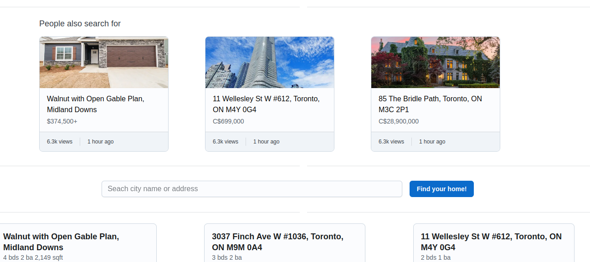
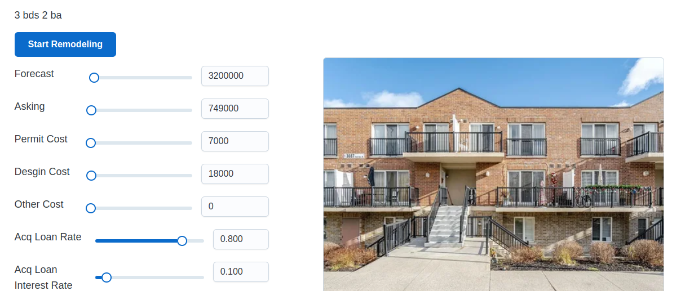
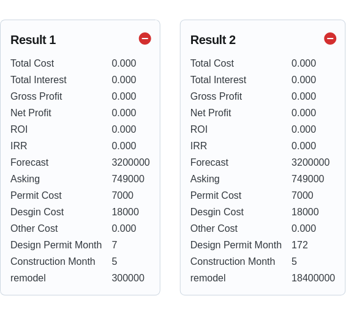

# Introduction

* This is a public project derived from another private project. It can be used to estimate the cost of house remodeling and the profit from reselling. The calculation part has now been removed, so the remaining content is safe to display. Below are some images from this project.

# How to run
* front-end : in folder 'home-legion', `npm install`. Then `npm run start`.
* Back-end: set Python path and IP address in `run.sh`. Then `bash run.sh` 
